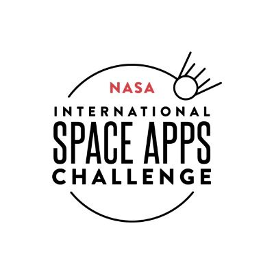

<!-- PROJECT LOGO -->
 

  

  <h3 align="center">NASA SPACE APPS CHALLENGE 2020</h3>

  

    This project is being developed for NASA Space Apps Challenge 2020 Virtual Hackathon in creating an Automated Detection of Hazards.
     
    <a href="https://github.com/muhdlaziem/automated-hazard-detection"><strong>Explore the docs »</strong></a>
     
     
  

<!-- TABLE OF CONTENTS -->
## Table of Contents

* [About the Project](#about-the-project)
  * [Built With](#built-with)
* [Description](#description)
* [License](#license)
* [Contact](#contact)
* [Contributing](#contributing)
* [Resources](#resources)

<!-- ABOUT THE PROJECT -->
## About The Project

Building a web application to predict the PM2.5 value. The value then is evaluate to determine the quality of air. However, since the project is still at early stage, our model still have so much room for improvements. We also planned to add more functionalities such as sending alert message to notify user.

### Built With

* [TensorFLow](https://www.tensorflow.org/)
* [Flask](https://flask.palletsprojects.com/en/1.1.x/)
* [Heroku](https://www.heroku.com/)

<!-- GETTING STARTED -->
## Description

Countless phenomena such as floods, fires, and air pollution routinely impact ecosystems, economies, and human safety.
Using deep learning, our regressor model is specialize in calculating the air quality in Particulate Matter 2.5 (PM2.5) measurement provided a few other factors which are Relative Humidity (RH), UGRD & VGRD, Height of Planetary Boundary Layer (HPBL), Temperature (TMP) and AOD reading from GOES R.

<!-- LICENSE -->
## License

Distributed under the [MIT](https://choosealicense.com/licenses/mit/) License.

<!-- CONTACT -->
## Contact

Muhammad Amiruddin bin Bustaman - [@amrnumenor](https://github.com/amrnumenor) - m.amiruddin27@gmail.com

Muhammad Laziem Bin Shafie - [@muhdlaziem](https://github.com/muhdlaziem) - muhdlaziem@gmail.com

Project Link: [Automated-Hazard-Detection](https://github.com/muhdlaziem/automated-hazard-detection)

## Contributing
Pull requests are welcome. For major changes, please open an issue first to discuss what you would like to change.

## Resources

* [Phenomena Detection Resources](https://sa-2019.s3.amazonaws.com/media/documents/Space_Apps_Phenomena_Detection_Resources.docx)
* [Automated Detection of Hazards Resources](https://2020.spaceappschallenge.org/challenges/inform/automated-detection-hazards/resources)